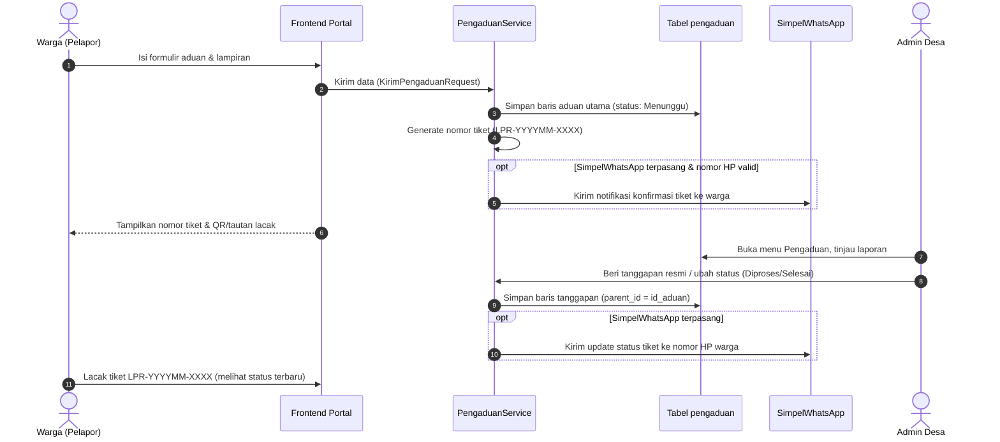

# Rancangan Modul: SimpelPengaduan

> Rekam jejak rancangan arsitektur dan keputusan teknis modul SimpelPengaduan (v1.0.0).
> Sumber kebenaran engine: `SimpelCore/Docs/arsitektur.md` + `konvensi-pengembangan.md`.

---

## 1. Latar Belakang & Tujuan

OpenSID memiliki tabel bawaan `pengaduan` untuk menampung aduan dari masyarakat desa. Namun, alur operasional pengelolaan aduan seringkali membutuhkan:
1. **Identifikasi unik yang mudah diingat warga**: Kode tiket pelacakan otomatis (format `LPR-YYYYMM-XXXX`) agar warga dapat memantau progres tanpa harus login ke sistem.
2. **Komunikasi interaktif dua arah**: Utas percakapan (*threaded conversation*) antara admin desa dan warga pelapor untuk meminta klarifikasi atau bukti tambahan.
3. **Notifikasi instan via WhatsApp**: Konfirmasi tiket dibuat dan kabar pembaruan status tindak lanjut yang dikirim langsung ke nomor WhatsApp pelapor melalui `SimpelWhatsApp`.
4. **Antarmuka modern & responsif**: Halaman publik berbasis Tailwind + AJAX yang ramah ponsel serta panel admin berbasis komponen standar `SimpelCore`.

Modul **SimpelPengaduan** mengintegrasikan seluruh kebutuhan tersebut dengan memanfaatkan tabel inti `pengaduan` yang ada di OpenSID tanpa mengubah struktur dasarnya secara merusak.

---

## 2. Skema Data & Integrasi Database

Modul menggunakan tabel `pengaduan` bawaan OpenSID dengan struktur hierarkis (`parent_id` / relasi rekursif):

- **Tabel `pengaduan`**:
  - `id`: Primary key
  - `config_id`: Identitas multi-desa (tenant)
  - `nama`: Nama pelapor / nama instansi penanggap
  - `nik`: NIK pelapor (opsional untuk aduan umum)
  - `telepon`: Nomor kontak / WhatsApp pelapor
  - `email`: Alamat email pelapor (opsional)
  - `judul`: Ringkasan topik aduan
  - `isi`: Uraian detail aduan atau teks tanggapan
  - `foto`: Lampiran bukti foto/dokumen pendukung
  - `status`: Status tindak lanjut (`1` = Menunggu, `2` = Diproses, `3` = Selesai, `4` = Ditolak)
  - `parent_id`: `null` untuk aduan utama; berisi `id` aduan utama untuk baris respons percakapan
  - `created_at`, `updated_at`: Waktu pencatatan

### Penomoran Tiket Virtual
Tiket virtual dihasilkan secara deterministik melalui nomor urut bulanan:
- Format: `LPR-YYYYMM-XXXX` (contoh: `LPR-202609-0001`).
- Ditranslasikan otomatis oleh helper `PengaduanService::tiketToId()` dan `PengaduanService::idToTiket()`.

---

## 3. Arsitektur Komponen & Routing

### 3.1 Backend (Panel Admin)
Prefix URL: `simpel/pengaduan` (Namespace: `Modules\SimpelPengaduan\Http\Controllers\BackEnd`)
- `GET  /` -> `PengaduanController@index`: Dashboard metrik ringkasan status aduan & tabel interaktif.
- `GET  /datatables` -> `PengaduanController@datatables`: Endpoint AJAX server-side DataTables.
- `GET  /detail/{id}` -> `PengaduanController@detail`: Halaman detail aduan, data pelapor, lampiran, dan riwayat utas tanggapan.
- `POST /tanggapi/{id}` -> `PengaduanController@tanggapi`: Menambah balasan resmi admin desa ke dalam utas.
- `POST /status/{id}` -> `PengaduanController@ubahStatus`: Mengubah status tindak lanjut tiket.
- `POST /delete` -> `PengaduanController@hapus`: Hapus tiket aduan bersangkutan.

### 3.2 Frontend (Portal Publik Warga)
Prefix URL: `layanan-pengaduan` (Namespace: `Modules\SimpelPengaduan\Http\Controllers\FrontEnd`)
- `GET  /` -> `PengaduanWargaController@index`: Formulir pengajuan aduan baru & pencarian pelacakan tiket.
- `POST /kirim` -> `PengaduanWargaController@store`: Validasi FormRequest & simpan aduan baru.
- `GET  /lacak` -> `PengaduanWargaController@lacak`: Menampilkan status aduan dan percakapan berdasarkan nomor tiket.
- `POST /tanggapi/{id}` -> `PengaduanWargaController@balas`: Warga mengirim tanggapan balasan pada tiket yang sedang berjalan.

---

## 4. Alur Bisnis & Integrasi WhatsApp

---

## 5. Kompatibilitas Runtime & Standar Kepatuhan

1. **Dukungan Dua Target Runtime**:
   - **I10**: PHP 8.1 / Illuminate 10 (OpenSID Umum semua rilis + Premium `v2601`–`v2605`).
   - **L13**: PHP 8.4 / Laravel 13 (OpenSID Premium `v2606`+).
2. **Pencegahan Hazard CI3/Laravel**:
   - Dilarang keras memakai `now()`/`today()` bare -> wajib `\Carbon\Carbon::now()`.
   - Respons AJAX murni menggunakan helper global `json()`, bukan `response()->json()`.
   - Tidak menggunakan named routes `->name()` untuk mencegah tabrakan rute inti.
3. **Standar Ukuran Controller**:
   - Seluruh method ≤ 40 baris.
   - Ukuran controller ≤ 250 baris (`PengaduanController`: 183 baris, `PengaduanWargaController`: 134 baris).
   - Validasi data terpusat di `Http/Requests/KirimPengaduanRequest` dan `TanggapiPengaduanRequest`.
